# Using Subordinate

Everything the MVP does, in the order a cut goes through it: import the
footage, edit it, mix it, export it, with proxies underneath when the footage
is heavy and the picture on a second screen when one is available.

This is the editor's side. Writing a plugin is
[docs/plugin-guide.md](plugin-guide.md), driving the editor from an agent is
[docs/mcp-guide.md](mcp-guide.md), and building it from source is
[docs/DEVELOPMENT.md](DEVELOPMENT.md).

- [Starting up](#starting-up)
- [The window](#the-window)
- [Importing media](#importing-media)
- [Editing](#editing)
- [Audio](#audio)
- [Export](#export)
- [Proxies](#proxies)
- [The pop-out viewer](#the-pop-out-viewer)
- [Keyboard shortcuts](#keyboard-shortcuts)
- [Troubleshooting](#troubleshooting)

Every screenshot below is a committed UI test reference, rendered by the
`egui_kittest` suite in `crates/sub-ui/tests` and re-recorded whenever the
panel changes (docs/DEVELOPMENT.md, *UI tests*). They are pictures of the build
they ship with rather than captures someone took once.

## Starting up

`subordinate` opens the editor, optionally on a project:

```bash
subordinate                  # an empty project
subordinate ~/cuts/demo.sub  # open this project at startup
subordinate --help
```

A project is a single `project.sub` JSON file. Beside it the editor keeps a
sidecar directory of derived data — `demo.sub` owns `demo.sub.d/` — holding
thumbnails, waveforms, proxies and autosave snapshots. Deleting the sidecar
costs regeneration time and nothing else, and it is never worth committing to
version control.

**File** holds Open, Save, Save as and **Snapshot history**, which lists the
autosave snapshots newest first. If the editor was interrupted with unsaved
work, opening the project offers the newer snapshot before anything else is
drawn.

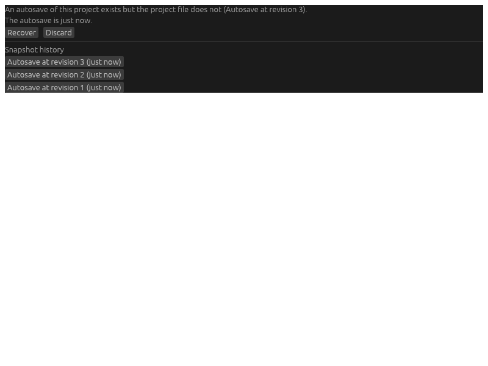

Everything the menus, the panels, the Command API, a plugin and the MCP bridge
do is the same command set, so an edit made from outside the window shows up in
the panels on the next frame.

## The window

Five dockable panels — **Media**, **Timeline**, **Viewer**, **Inspector** and
**Export** — plus the windows behind the menu bar: Hardware diagnostics, Audio
settings and Keyboard shortcuts. Drag a panel by its tab to re-dock it; the
arrangement is saved on exit and restored next time, and **View > Reset
layout** puts it back to the shipped one.

Above the dock is the sequence tab strip: one tab per sequence in the project,
and which one is being edited.


## Importing media

Import from the **Media** panel: **Import...** opens a file dialog, or drop
files onto the panel from the desktop.

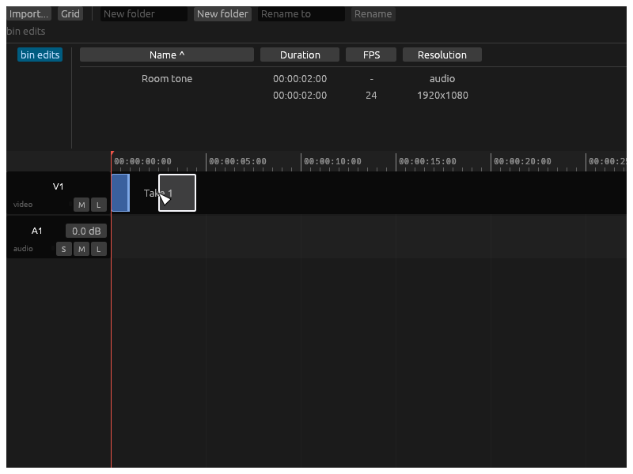

Each file becomes one background job — hash the bytes, probe the streams with
the GStreamer discoverer, build the media item — and then a second job for its
thumbnail strip. Nothing about an import happens on the UI thread, so importing
a long file never freezes the window, and an import is applied as an undoable
command like any other edit.

Media paths are stored relative to the project, so a file has to live in or
under the project folder: importing from elsewhere is refused with
`model.invalid_path` rather than silently storing an absolute path that will
not survive being moved to another machine. Copy the footage into the project
folder first.

The bin lists items or tiles them, sorts by any column, and files them in
folders you create and rename. Durations are timecodes at the item's own rate
and the frame-rate column is exact: 24000/1001 reads as `23.976`.

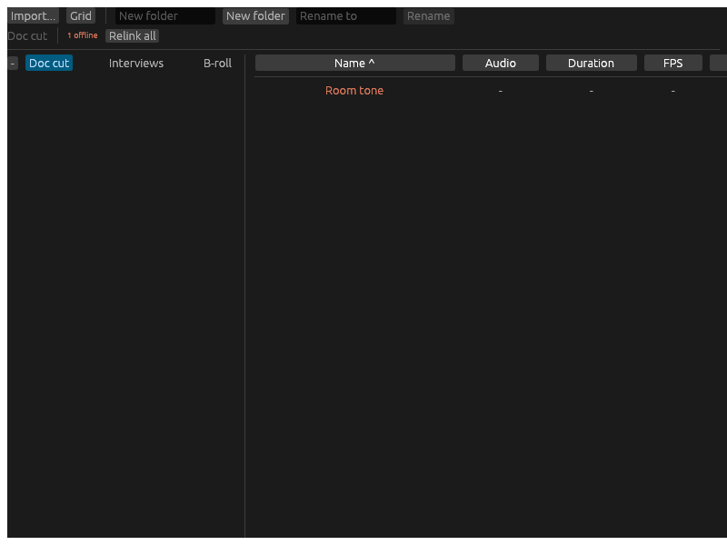

Two badges on a row are not metadata: whether the file is **offline** (missing)
and which [proxy](#proxies) state the item is in.

**Relinking.** When footage moves, select the offline item and relink it:
either point at the replacement file directly, or point at a folder and let the
search find it — by content hash first, and only then by name. The search runs
as a job, so hashing a card of footage never blocks the window, and relinking
twenty items is one entry in the undo stack.

## Editing

Drag an item from the bin onto a track — the timeline shows where it would
land before the drop — or put the playhead where it belongs and use the bin's
selection: `,` inserts at the playhead and ripples what follows,
`.` overwrites from the playhead.


- **Tools.** `V` is the arrow, which selects and drags clips; `C` is the razor,
  which cuts the clip it is clicked on. `Ctrl+K` splits every clip under the
  playhead without changing tools.
- **Trimming.** Drag a clip's edge. The handles appear on hover, and the
  timeline shows the frame you are trimming to.
- **Snapping.** `S` turns snapping on and off. With it on, edges snap to clip
  boundaries, the playhead and markers.
- **Nudging.** `Alt+,` and `Alt+.` move the selection one frame.
- **Markers.** `M` drops a marker at the playhead; `I` and `O` set the in and
  out points a range export uses.
- **Transitions.** A crossfade is the one transition the MVP has. It is added
  at a cut with the `transition.add` command (from a script, an agent or a
  plugin); on the timeline, dragging either edge of the region it blends
  across changes its duration, symmetrically, with the cut staying put.

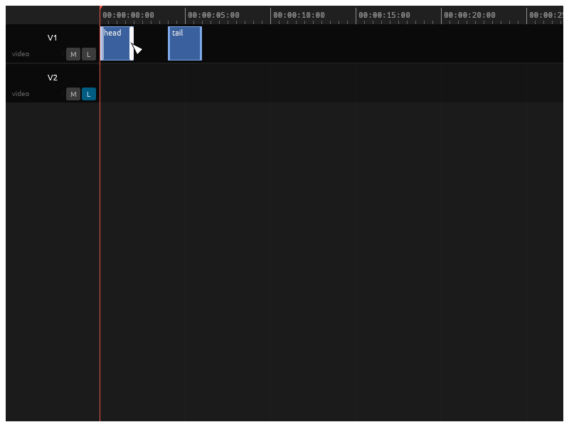
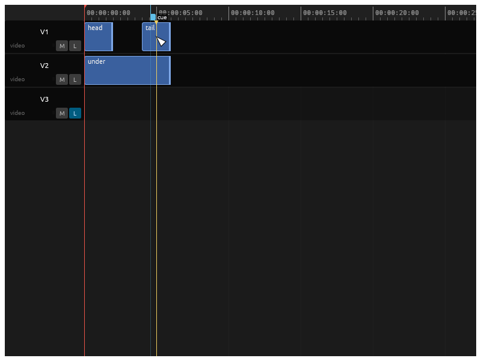
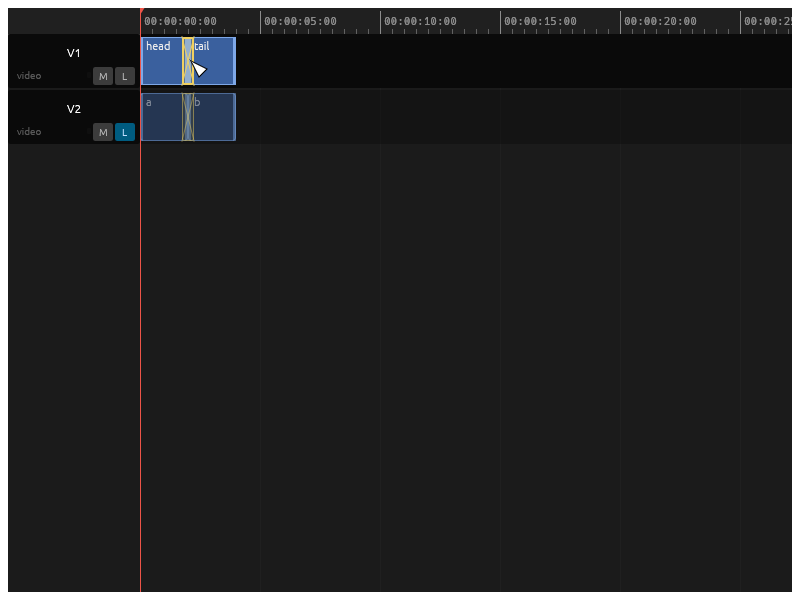
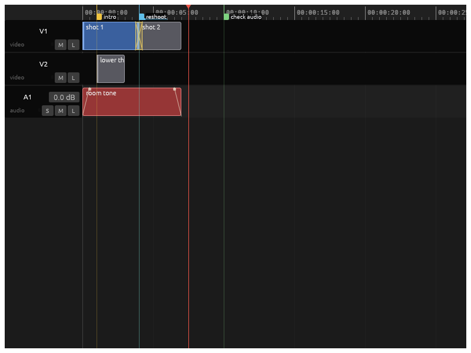

**Tracks.** Each header carries the track's name, mute and lock, and the menu
that adds, removes, renames and reorders tracks. A locked track refuses edits;
a muted one is skipped by the compositor or the mixer.

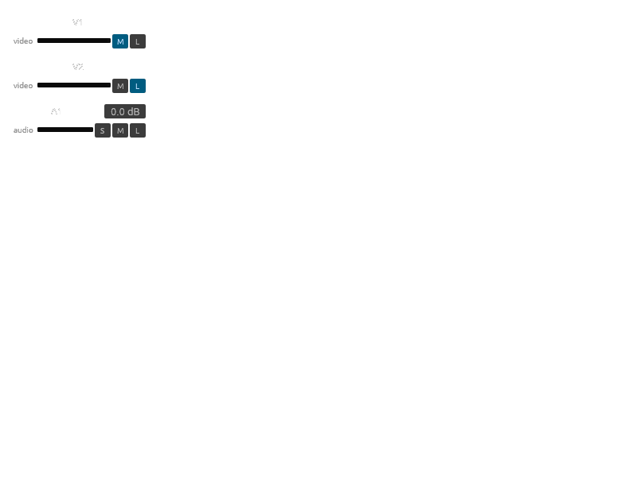

**The inspector** holds the selected clip's parameters: opacity, transform,
gain and the two fades. Dragging a slider recomposites the viewer under the
pointer, and the whole gesture is a single undo entry. With several clips
selected the fields show the first one selected and an edit applies to every
selected clip on an unlocked track.

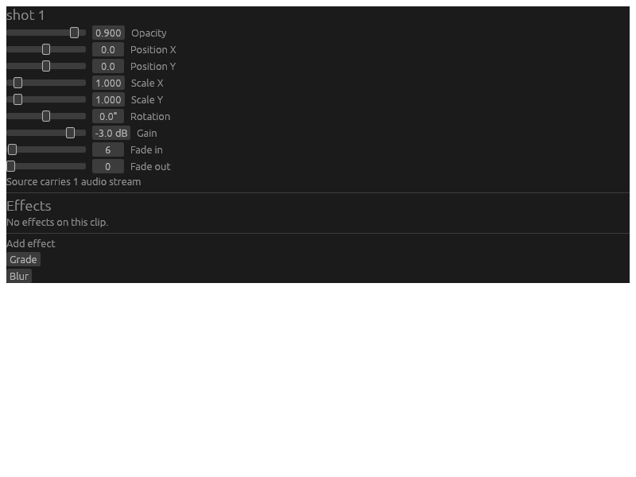

Below the sliders is the clip's effect stack, in the order the compositor runs
it. Effects are `effect`-world plugins: the controls are generated from what
the plugin declared, so an installed plugin needs nothing added here to be
usable (see [docs/plugin-guide.md](plugin-guide.md)).

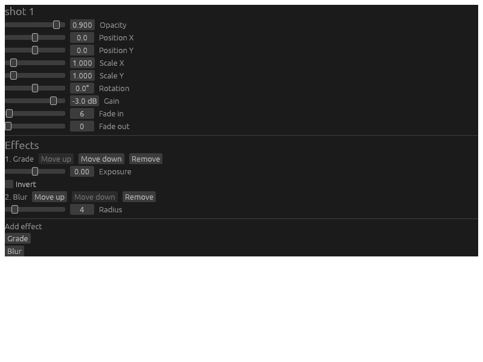

**Undo.** Every mutation — an import, a trim, a slider drag, a relink — is a
command on one history stack. `Ctrl+Z` and `Ctrl+Shift+Z` walk it, and the
history panel shows what is on it and jumps to any point.

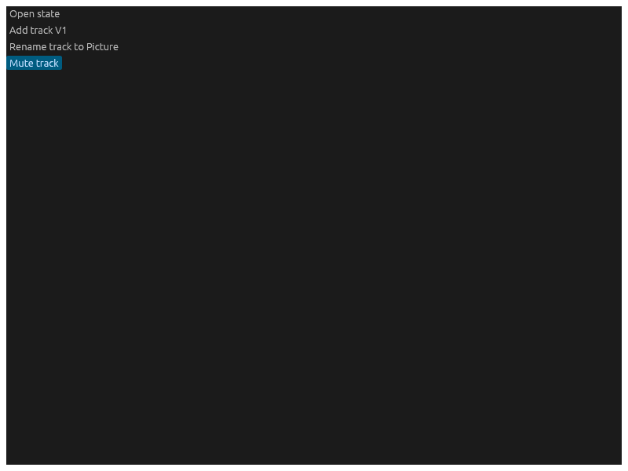

## Audio

Playback runs on the audio clock and the picture follows it, so audio never
stretches to keep up with video.

- **Levels.** An audio track header carries a gain in decibels and a solo
  toggle beside the mute and lock every track has. Gain is dragged like an
  inspector slider: live, and one undo entry for the gesture.
- **Meters.** Every track and the master have a meter, fed by atomics the audio
  callback publishes — the callback itself never locks and never allocates. The
  bar falls immediately, the peak hold falls slowly, and a clipped block
  latches the clip indicator so a single overload between two frames is still
  seen.
- **Fades.** An audio clip has a fade in and a fade out, dragged by the
  handles at its ends or set with the inspector's fade sliders. A fade is
  clamped to what is left of the clip rather than refused.
- **Waveforms.** Peaks are generated in the background and drawn on the clips
  from a cached texture per source, at the zoom level that puts about one peak
  per pixel.
- **Scrubbing.** Dragging the playhead plays short audio grains, so a cut can
  be found by ear. It is switched off in **Audio settings** when it is not
  wanted.
- **Devices.** **Audio settings** lists the output devices and switches the
  stream between them, and reports how the stream is doing.

Everything mixes at the sequence sample rate: clip sources are resampled on the
way in, through clip gain and fades, then track gain, mute and solo, then the
master. Export renders the same graph offline, so what is exported is what was
heard.

## Export

The **Export** panel: choose a sequence, a preset, a range and an output file,
then watch the render.

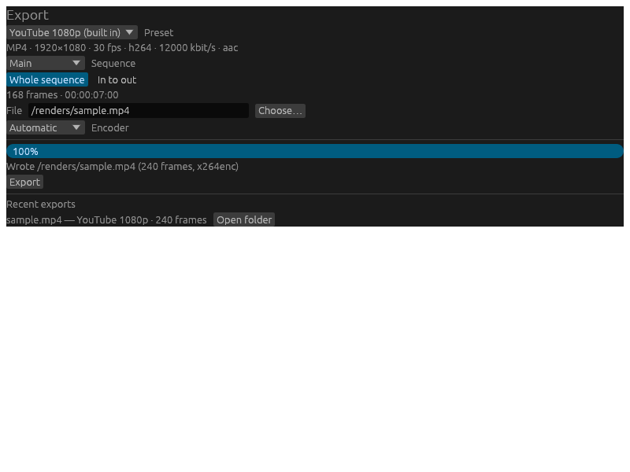

The shipped presets are `youtube-1080p`, `youtube-4k`, `mezzanine` (visually
lossless, software), `h265-archive`, `av1-archive` and `audio-only`. Presets are data, not
code: a TOML file in the config directory adds presets and replaces built-ins by
id, and exporter plugins contribute presets that sit in the same list.

The range is either the whole sequence or the in-to-out range set with `I` and
`O`. The encoder is **Automatic** unless one is pinned — see
[Troubleshooting](#troubleshooting).

While a job runs the panel shows progress, an ETA and **Cancel**; a finished
job offers to open the folder it wrote into. Export always reads the original
media, never a proxy, and the compositor renders at full resolution and never
drops a frame, however slow that is.

The canvas and the frame rate that are written are the **sequence's**, not the
preset's: the compositor draws at the sequence's own resolution and nothing
rescales a finished frame, so a preset that asks for another size is honoured in
everything else — container, codecs, quality, audio format — and the difference
is noted rather than written into the file.

Save the project before exporting. A clip names its media relative to the
project file, so a project that has never been written to disk has no folder for
those paths to resolve against and the **Export** button stays closed until it
does.

The same export runs headlessly, and it is the same render — the editor and the
command below share one bridge from a sequence to an encoder, so both write the
same frames and the same audio:

```bash
subordinate-cli render demo.sub --sequence Main --preset youtube-1080p \
  --out demo.mp4 --verify
```

Progress goes to stderr and a JSON report to stdout. `--range in:out` renders
frames of the sequence timebase, `--encoder <element>` pins the encoder, and
`--verify` probes the written file afterwards.

## Proxies

A long-GOP camera file scrubs badly: every frame the playhead lands on needs
the whole GOP before it decoded first. A proxy is the same pictures re-encoded
intra-only — DNxHR LB or MJPEG — at half or quarter resolution, so a seek costs
one frame.

Proxies live in the sidecar directory and are named from the source's content
hash and the proxy options, so one already there is reused instead of being
made again, on any machine. Generation is a background job that reports
progress in frames and stops promptly when cancelled; variable-frame-rate
sources get a PTS index built first, so nothing assumes a constant frame
duration.

The bin badges every item with its proxy state:

| Badge | Meaning |
| --- | --- |
| `NO PROXY` | No proxy; the preview reads the original. |
| `PROXY...` | Being generated. |
| `PROXY` | Ready; hover to see which file the preview uses. |
| `PROXY STALE` | The source changed after the proxy was made. |
| `PROXY FAILED` | Generation failed; the original is used. |

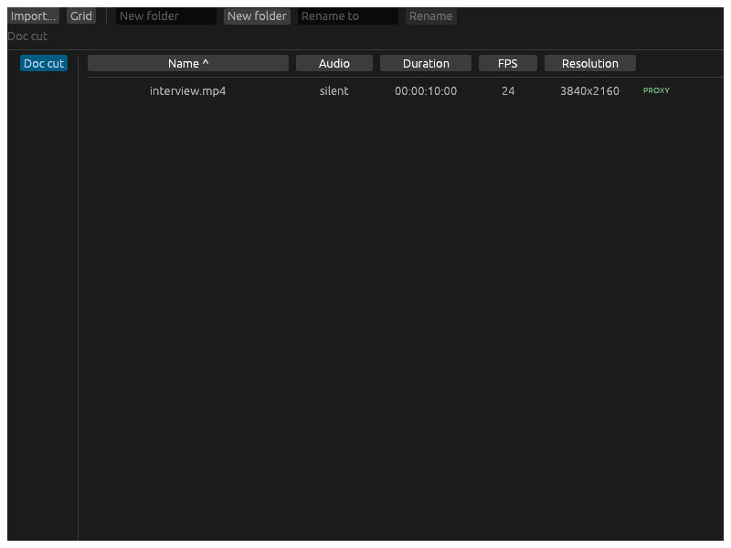
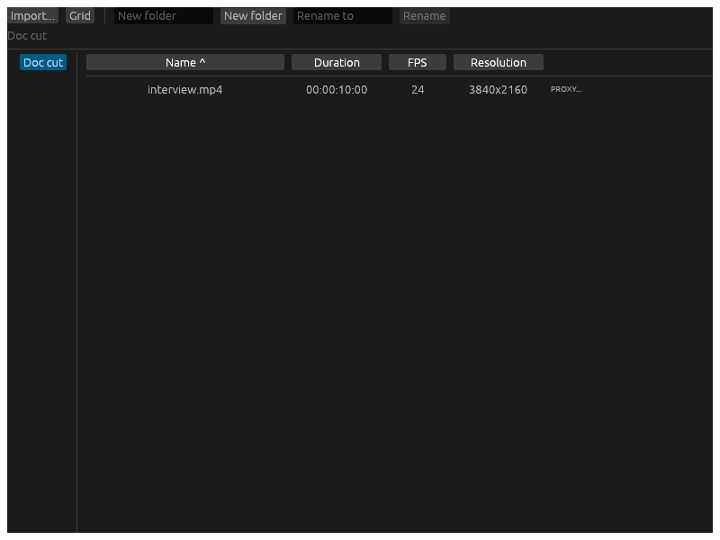

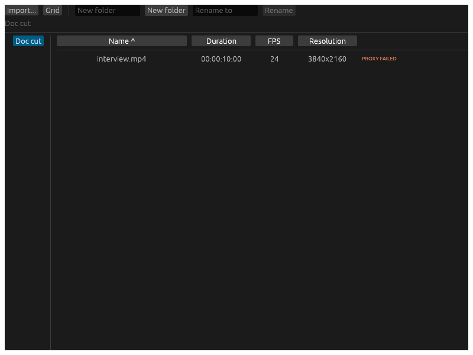

The viewer's **Proxy** button is the preview switch. With it on, an item whose
proxy is *ready* previews from the proxy; every other case — the switch off, a
proxy still generating, one that failed, one gone stale — previews from the
original. **Export ignores the switch entirely**: a proxy can never reach a
delivered file.

Generating a proxy is the `media.make_proxy` command, so it can be asked for
from an agent or a script as well as from the editor:

```jsonc
// through the MCP bridge: media_make_proxy
{"media": "<media id>"}
```

## The pop-out viewer

**View > Pop out viewer** moves the preview into an OS window of its own, which
can be dragged to a second monitor and made fullscreen there (**View** lists
the displays the platform lets the editor describe). **Return viewer to the
dock** puts it back, and so does closing the window.


The pop-out costs almost nothing: it paints the very texture the docked viewer
paints, on the same GPU device, so there is no second composite, no readback
and no copy. Playback keys pressed in the pop-out window drive the same
playhead as the ones pressed in the editor window.

## Keyboard shortcuts

`F1` opens the same list inside the editor. Modifiers are matched exactly, so
`Ctrl+Shift+Z` is redo and never falls through to undo, and **Ctrl is Cmd on
macOS** everywhere below.

<!-- shortcuts:begin -->

### Transport

| Shortcut | Action | Action id |
| --- | --- | --- |
| `J` | Play backward | `transport.play_backward` |
| `K` | Pause | `transport.pause` |
| `L` | Play forward | `transport.play_forward` |
| `Space` | Play / pause | `transport.toggle_playback` |
| `Left` | Step one frame back | `transport.step_back` |
| `Right` | Step one frame forward | `transport.step_forward` |
| `Home` | Go to start | `transport.go_to_start` |
| `End` | Go to end | `transport.go_to_end` |

### Marking

| Shortcut | Action | Action id |
| --- | --- | --- |
| `I` | Set in point | `marking.set_in_point` |
| `O` | Set out point | `marking.set_out_point` |
| `M` | Add marker | `marking.add_marker` |

### Editing

| Shortcut | Action | Action id |
| --- | --- | --- |
| `Ctrl+K` | Split at playhead | `editing.split_at_playhead` |
| `V` | Select tool | `editing.select_tool` |
| `C` | Razor tool | `editing.razor_tool` |
| `Comma` | Insert at playhead | `editing.insert_at_playhead` |
| `Period` | Overwrite at playhead | `editing.overwrite_at_playhead` |
| `Alt+Comma` | Nudge one frame back | `editing.nudge_back` |
| `Alt+Period` | Nudge one frame forward | `editing.nudge_forward` |
| `Ctrl+Z` | Undo | `editing.undo` |
| `Ctrl+Shift+Z` | Redo | `editing.redo` |

### View

| Shortcut | Action | Action id |
| --- | --- | --- |
| `S` | Toggle snapping | `view.toggle_snapping` |
| `F1` | Keyboard shortcuts | `view.show_shortcut_help` |
<!-- shortcuts:end -->

**Remapping.** A `keymap.toml` in the config directory
(`$XDG_CONFIG_HOME/subordinate` or `~/.config/subordinate` on Linux,
`%APPDATA%\subordinate` on Windows,
`~/Library/Application Support/subordinate` on macOS; `SUBORDINATE_CONFIG_DIR`
overrides it) rebinds actions by the action id in the table above:

```toml
[bindings]
"editing.split_at_playhead" = "Ctrl+K"
"view.toggle_snapping" = "S"
"marking.add_marker" = "none"   # unbound
```

A missing file leaves the defaults alone. A malformed entry, or one naming an
action that does not exist, is ignored and reported at the bottom of the
Keyboard shortcuts window — a keymap is never a reason for the editor to refuse
to start.

## Troubleshooting

### Export is slow, or there is no hardware encoder

Open **Hardware diagnostics** in the menu bar. It lists every decoder and
encoder this installation actually registered, which of the expected ones are
missing, and what to install for each. `subordinate-cli diag` prints the same
report as JSON.

Which encoder an export uses is a per-machine question, answered by
instantiating each catalogued encoder and asking it to reach `READY` — an
element whose factory exists but whose driver is missing does not count as
available. The first one in this order that gets there wins:

| Platform | Order |
| --- | --- |
| NVIDIA | `nvh264enc`, `nvh265enc`, `nvav1enc` (plugin `nvcodec`) |
| AMD/Intel on Linux | `vah264enc`, `vah265enc`, `vaav1enc` (plugin `va`) |
| AMD on Windows | `amfh264enc`, `amfh265enc`, `amfav1enc` (plugin `amfcodec`) |
| macOS | `vtenc_h264`, `vtenc_h265` (plugin `applemedia`) |
| Windows fallback | `mfh264enc`, `mfh265enc` (Media Foundation) |
| Anywhere | `x264enc` / `x265enc`, and for AV1 `svtav1enc`, `av1enc` or `rav1enc` (software) |

So a machine with no hardware encoder still exports — on the CPU, slower. If
nothing at all is available the export fails with
`export.encoder_unavailable`, naming the codec nothing could encode.

**Installing the missing plugin.** The diagnostics panel prints the step for
the vendor and platform it found missing; these are the same steps as
docs/DEVELOPMENT.md, *GStreamer*:

- **Linux, NVIDIA:** `nvcodec` ships in `gstreamer1.0-plugins-bad` and needs
  the NVIDIA driver at runtime:
  `sudo apt-get install -y gstreamer1.0-plugins-bad`.
- **Linux, software:** `x264enc` is in `gstreamer1.0-plugins-ugly` and the
  libav decoders in `gstreamer1.0-libav`.
- **Linux, VA-API:** the `va` plugin is not packaged by Ubuntu and
  `gstreamer-vaapi` was removed upstream in 1.28. Use Fedora 44+, Arch, or
  Homebrew (`brew install gstreamer`).
- **Windows:** install the official GStreamer MSVC x86_64 build for the pinned
  version and put its `bin` directory on `PATH`; that build includes
  `nvcodec`, `amfcodec` and `mediafoundation`.
- **macOS:** install both the runtime and devel packages from the official
  macOS build, which includes `applemedia`.

**Pinning an encoder.** When the automatic choice is wrong — a driver that
encodes but produces bad output, or a comparison you want to make — pick the
element in the export panel instead of **Automatic**, or pass
`--encoder <element>` to `subordinate-cli render`. An override names one
element for one codec and leaves every other codec on the normal order; it is
stored in settings and travels between machines, so pinning an encoder this
machine lacks is allowed and simply falls back to the probe.

### Playback stutters

Generate [proxies](#proxies) for the heavy sources and turn the viewer's
**Proxy** switch on. The preview may also drop frames under load by design —
export never does.

### An item is offline

Its file moved. [Relink](#importing-media) it from the bin.

### Nothing decodes at all

A missing GStreamer installation is the likeliest cause; the diagnostics panel
will show almost everything missing. Follow docs/DEVELOPMENT.md, *GStreamer*,
for the platform, then restart the editor — the registry is scanned once per
run.
